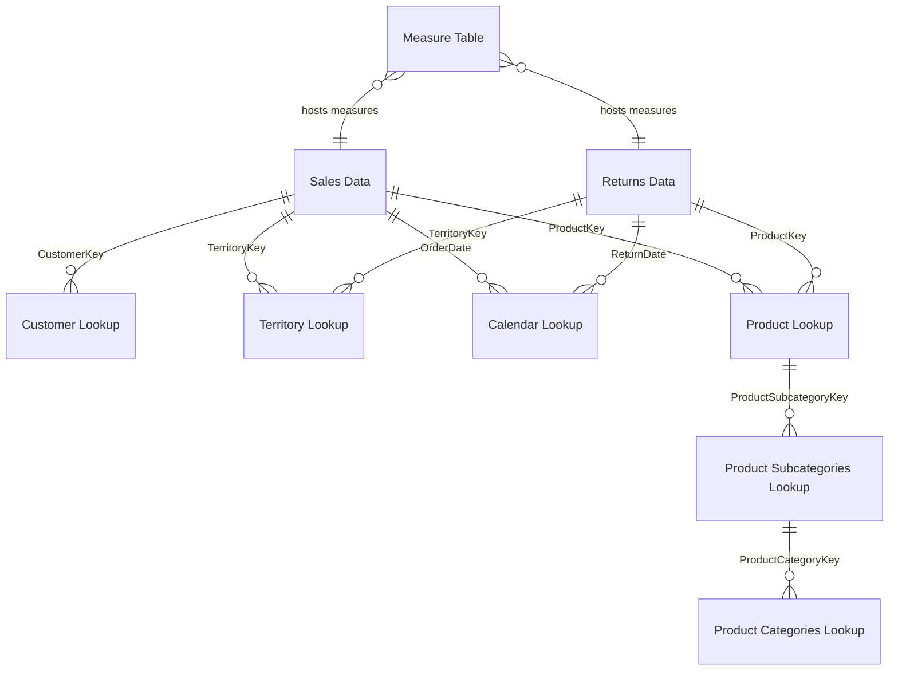

# AdventureWorks Report - Semantic Model Documentation

**Last Updated:** November 24, 2025  
**Model Version:** 1.0  
**Compatibility Level:** 1567  
**Culture:** Russian (ru-RU)  
**Default Query Culture:** English (en-US)

---

## Table of Contents
1. [Model Overview](#model-overview)
2. [Tables](#tables)
3. [DAX Measures](#dax-measures)
4. [Calculated Columns](#calculated-columns)
5. [Relationships](#relationships)
6. [Relationship Diagram](#relationship-diagram)
7. [Potential Issues & Recommendations](#potential-issues--recommendations)

---

## Model Overview

The AdventureWorks Report semantic model contains **9 tables**, **56 DAX measures**, and **9 active relationships**. The model is designed to support sales analytics, customer analysis, product performance tracking, and financial reporting.

**Key Statistics:**
- Total Measures: 56
- Total Tables: 9
- Total Relationships: 9
- Data Mode: Import
- Source Query Culture: en-US
- Model Culture: ru-RU

---

## Tables

| Table Name | Columns | Type | Purpose |
|---|---|---|---|
| Sales Data | 9 | Fact | Core transactional sales records |
| Returns Data | 4 | Fact | Product return information |
| Measure Table | 56 | Measure | DAX calculations and KPIs |
| Customer Lookup | 21 | Dimension | Customer attributes and demographics |
| Product Lookup | 15 | Dimension | Product information and pricing |
| Territory Lookup | 4 | Dimension | Sales territory information |
| Calendar Lookup | 13 | Dimension | Time dimension with date attributes |
| Product Categories Lookup | 2 | Dimension | Product category hierarchy |
| Product Subcategories Lookup | 3 | Dimension | Product subcategory hierarchy |

---

## DAX Measures

### Base Sales Metrics

| Name | Expression | Folder | Description | Format |
|---|---|---|---|---|
| Quantity Sold | `SUM('Sales Data'[OrderQuantity])` | Sales | Total number of items sold across all orders | Number |
| Quantity Returned | `SUM('Returns Data'[ReturnQuantity])` | Returns | Total number of items returned | Number |
| Total Orders | `DISTINCTCOUNT('Sales Data'[OrderNumber])` | Sales | Count of unique orders placed | Number |
| Total Customers | `DISTINCTCOUNT('Sales Data'[CustomerKey])` | Sales | Count of unique customers | Number |
| Total Returns | `COUNT('Returns Data'[ReturnQuantity])` | Returns | Total count of return transactions | Number |
| Return Rate | `DIVIDE([Quantity Returned], [Quantity Sold], "No Sales")` | Returns | Percentage of items returned vs sold | Percentage |

### Revenue & Cost Metrics

| Name | Expression | Folder | Description | Format |
|---|---|---|---|---|
| Total Revenue | `SUMX('Sales Data', 'Sales Data'[OrderQuantity] * RELATED('Product Lookup'[ProductPrice]))` | Financial | Total revenue from all sales | Currency |
| Total Cost | `SUMX('Sales Data', 'Sales Data'[OrderQuantity] * RELATED('Product Lookup'[ProductCost]))` | Financial | Total cost of goods sold | Currency |
| Total Profit | `[Total Revenue] - [Total Cost]` | Financial | Gross profit (Revenue - Cost) | Currency |
| Average Retail Price | `AVERAGE('Product Lookup'[ProductPrice])` | Pricing | Average product price across catalog | Currency |
| Overall Average Price | `CALCULATE([Average Retail Price], ALL('Product Lookup'))` | Pricing | Overall average price ignoring filters | Currency |
| Average Revenue per Customer | `DIVIDE([Total Revenue], [Total Customers])` | Financial | Revenue per unique customer | Currency |
| Average Order Value | `DIVIDE([Total Revenue], [Total Orders], 0)` | Financial | Average revenue per order | Currency |
| Revenue per Unit | `DIVIDE([Total Revenue], [Quantity Sold], 0)` | Pricing | Revenue per item sold | Currency |
| Cost per Unit | `DIVIDE([Total Cost], [Quantity Sold], 0)` | Pricing | Cost per item sold | Currency |

### Profitability Analysis

| Name | Expression | Folder | Description | Format |
|---|---|---|---|---|
| Gross Margin % | `DIVIDE([Total Revenue] - [Total Cost], [Total Revenue], 0)` | Profitability | Gross margin percentage | Percentage |
| Profit Margin % | `DIVIDE([Total Profit], [Total Revenue], 0)` | Profitability | Net profit margin percentage | Percentage |

### Order Analysis

| Name | Expression | Folder | Description | Format |
|---|---|---|---|---|
| Bulk Orders | `CALCULATE([Total Orders], 'Sales Data'[OrderQuantity] > 1)` | Orders | Count of orders with multiple items | Number |
| Weekend Orders | `CALCULATE([Total Orders], 'Calendar Lookup'[Weekend] = "Weekend")` | Orders | Count of orders placed on weekends | Number |
| High Ticket Orders | `CALCULATE([Total Orders], FILTER('Product Lookup', 'Product Lookup'[ProductPrice] > [Overall Average Price]))` | Orders | Count of orders with above-average price items | Number |
| All Orders | `CALCULATE([Total Orders], ALL('Sales Data'))` | Orders | Total orders across all contexts | Number |
| % of All Orders | `DIVIDE([Total Orders], [All Orders])` | Orders | Current orders as percentage of total | Percentage |

### Product-Specific Analysis

| Name | Expression | Folder | Description | Format |
|---|---|---|---|---|
| Bike Sales | `CALCULATE([Quantity Sold], 'Product Categories Lookup'[CategoryName] = "Bikes")` | Products | Total bikes sold | Number |
| Bike Returns | `CALCULATE([Total Returns], 'Product Categories Lookup'[CategoryName] = "Bikes")` | Returns | Total bike returns | Number |
| Bike Return Rate | `CALCULATE([Return Rate], 'Product Categories Lookup'[CategoryName] = "Bikes")` | Returns | Return rate for bikes | Percentage |
| Products Sold Count | `DISTINCTCOUNT('Product Lookup'[ProductKey])` | Products | Number of unique products sold | Number |
| Average Revenue per Product | `DIVIDE([Total Revenue], [Products Sold Count], 0)` | Products | Average revenue per product | Currency |
| Return Rate by Category | `DIVIDE(CALCULATE([Quantity Returned], ALL('Product Categories Lookup')), CALCULATE([Quantity Sold], ALL('Product Categories Lookup')), 0)` | Returns | Return rate by product category | Percentage |
| High Return Products | `SUMPRODUCT(('Product Lookup'[ProductKey] <> BLANK()) * (CALCULATE([Return Rate], 'Product Lookup'[ProductKey]) > 0.1))` | Returns | Count of products with >10% return rate | Number |

### Return Analysis

| Name | Expression | Folder | Description | Format |
|---|---|---|---|---|
| All Returns | `CALCULATE([Total Returns], ALL('Returns Data'))` | Returns | Total returns across all contexts | Number |
| % of All Returns | `DIVIDE([Total Returns], [All Returns])` | Returns | Current returns as percentage of total | Percentage |

### Time Intelligence Metrics

| Name | Expression | Folder | Description | Format |
|---|---|---|---|---|
| YTD Revenue | `CALCULATE([Total Revenue], DATESYTD('Calendar Lookup'[Date]))` | Time Intelligence | Year-to-date revenue | Currency |
| Previous Month Revenue | `CALCULATE([Total Revenue], DATEADD('Calendar Lookup'[Date], -1, MONTH))` | Time Intelligence | Revenue from previous month | Currency |
| Previous Month Orders | `CALCULATE([Total Orders], DATEADD('Calendar Lookup'[Date], -1, MONTH))` | Time Intelligence | Order count from previous month | Number |
| Previous Month Returns | `CALCULATE([Total Returns], DATEADD('Calendar Lookup'[Date], -1, MONTH))` | Time Intelligence | Returns from previous month | Number |
| Previous Month Profit | `CALCULATE([Total Profit], DATEADD('Calendar Lookup'[Date], -1, MONTH))` | Time Intelligence | Profit from previous month | Currency |
| Year-over-Year Revenue | `CALCULATE([Total Revenue], DATEADD('Calendar Lookup'[Date], -12, MONTH))` | Time Intelligence | Revenue from 12 months ago | Currency |
| Same Period Last Year Revenue | `CALCULATE([Total Revenue], DATEADD('Calendar Lookup'[Date], -365, DAY))` | Time Intelligence | Revenue from 365 days ago | Currency |
| 10-Day Rolling Revenue | `CALCULATE([Total Revenue], DATESINPERIOD('Calendar Lookup'[Date], MAX('Calendar Lookup'[Date]), -10, DAY))` | Time Intelligence | 10-day trailing revenue | Currency |
| 90-Day Rolling Profit | `CALCULATE([Total Profit], DATESINPERIOD('Calendar Lookup'[Date], LASTDATE('Calendar Lookup'[Date]), -90, DAY))` | Time Intelligence | 90-day trailing profit | Currency |

### Growth & Performance Metrics

| Name | Expression | Folder | Description | Format |
|---|---|---|---|---|
| Sales Growth % | `DIVIDE([Total Revenue] - [Previous Month Revenue], [Previous Month Revenue], 0)` | Growth | Month-over-month revenue growth percentage | Percentage |
| Year-over-Year Growth % | `DIVIDE([Total Revenue] - [Year-over-Year Revenue], [Year-over-Year Revenue], 0)` | Growth | Year-over-year revenue growth percentage | Percentage |
| Order Frequency | `DIVIDE([Total Orders], [Total Customers], 0)` | Customer | Average orders per customer | Number |
| Customer Repeat Purchase Rate | `DIVIDE(CALCULATE(DISTINCTCOUNT('Sales Data'[CustomerKey]), FILTER(ALL('Sales Data'), CALCULATE([Total Orders], 'Sales Data'[CustomerKey]) > 1)), [Total Customers], 0)` | Customer | Percentage of customers with repeat purchases | Percentage |
| Territory Performance Index | `DIVIDE([Total Revenue], (CALCULATE([Total Revenue], ALL('Territory Lookup')) / DISTINCTCOUNT('Territory Lookup'[SalesTerritoryKey])), 0)` | Performance | Territory performance relative to average | Number |

### Customer Analytics

| Name | Expression | Folder | Description | Format |
|---|---|---|---|---|
| Top 10% Customer Revenue | `CALCULATE([Total Revenue], TOPN(MAXX(ALL('Sales Data'[CustomerKey]), CALCULATE([Total Customers])) * 0.1, ALL('Sales Data'[CustomerKey]), CALCULATE([Total Revenue], 'Sales Data'[CustomerKey]), DESC))` | Customer | Revenue from top 10% of customers | Currency |
| Top 10% Customer % of Total | `DIVIDE([Top 10% Customer Revenue], [Total Revenue], 0)` | Customer | Top 10% customer revenue as % of total | Percentage |

### Engagement & Status

| Name | Expression | Folder | Description | Format |
|---|---|---|---|---|
| Days Since Last Order | `INT(TODAY() - MAX('Sales Data'[OrderDate]))` | Engagement | Number of days since most recent order | Number |

### Target Comparison Metrics

| Name | Expression | Folder | Description | Format |
|---|---|---|---|---|
| Revenue Target | `[Previous Month Revenue] * 1.1` | Targets | Target revenue (110% of previous month) | Currency |
| Order Target | `[Previous Month Orders] * 1.1` | Targets | Target order count (110% of previous month) | Number |
| Profit Target | `[Previous Month Profit] * 1.1` | Targets | Target profit (110% of previous month) | Currency |
| Revenue vs Target | `[Total Revenue] - [Revenue Target]` | Variance | Actual revenue variance from target | Currency |
| Revenue vs Target % | `DIVIDE([Revenue vs Target], [Revenue Target], 0)` | Variance | Revenue variance as percentage of target | Percentage |
| Profit vs Target | `[Total Profit] - [Profit Target]` | Variance | Actual profit variance from target | Currency |
| Profit vs Target % | `DIVIDE([Profit vs Target], [Profit Target], 0)` | Variance | Profit variance as percentage of target | Percentage |
| YTD % of Target | `DIVIDE([YTD Revenue], [Revenue Target] * 12, 0)` | Variance | Year-to-date progress toward annual target | Percentage |

---

## Calculated Columns

| Table | Column Name | Expression | Data Type | Description |
|---|---|---|---|---|
| Sales Data | Quantity Type | `IF('Sales Data'[OrderQuantity] > 1, "Multiple Items", "Single Item")` | String | Categorizes orders as single or multiple items |

---

## Relationships

| From Table | From Column | To Table | To Column | Type | Cardinality | Cross Filter | Active |
|---|---|---|---|---|---|---|---|
| Sales Data | CustomerKey | Customer Lookup | CustomerKey | Regular | Many-to-One | One Direction | ✓ |
| Sales Data | TerritoryKey | Territory Lookup | SalesTerritoryKey | Regular | Many-to-One | One Direction | ✓ |
| Sales Data | OrderDate | Calendar Lookup | Date | Regular | Many-to-One | One Direction | ✓ |
| Sales Data | ProductKey | Product Lookup | ProductKey | Regular | Many-to-One | One Direction | ✓ |
| Product Lookup | ProductSubcategoryKey | Product Subcategories Lookup | ProductSubcategoryKey | Regular | Many-to-One | One Direction | ✓ |
| Product Subcategories Lookup | ProductCategoryKey | Product Categories Lookup | ProductCategoryKey | Regular | Many-to-One | One Direction | ✓ |
| Returns Data | ProductKey | Product Lookup | ProductKey | Regular | Many-to-One | One Direction | ✓ |
| Returns Data | ReturnDate | Calendar Lookup | Date | Regular | Many-to-One | One Direction | ✓ |
| Returns Data | TerritoryKey | Territory Lookup | SalesTerritoryKey | Regular | Many-to-One | One Direction | ✓ |

---

## Relationship Diagram

---

## Potential Issues & Recommendations

### Critical Issues

| Issue | Severity | Description | Recommendation |
|---|---|---|---|
| Mixed Culture Configuration | ⚠️ Medium | Model uses Russian culture (ru-RU) with English source queries (en-US). This can cause unexpected formatting and sorting behavior. | Consider standardizing to a single culture. If international support is needed, use English and manage translations via object translations. |
| Time Intelligence Disabled | ⚠️ Medium | The annotation `__PBI_TimeIntelligenceEnabled = 0` indicates time intelligence may be disabled or limited. Some DAX time functions may not work optimally. | Verify if time intelligence features are intentionally disabled and whether they should be enabled for better date calculations. |
| No Date Hierarchy on Calendar Table | ⚠️ Low | Calendar Lookup table has Date as key but no pre-built hierarchy (Year-Quarter-Month-Day). | Consider adding a user hierarchy to Calendar Lookup for easier report filtering and grouping. |

### Performance Considerations

| Item | Concern | Recommendation |
|---|---|---|
| Large TOPN Calculation | Medium | `Top 10% Customer Revenue` measure uses complex TOPN logic that could be slow on large datasets. | Consider pre-calculating top customer segments or using Power BI aggregations if dataset grows >1M rows. |
| Complex Filter Expression | Medium | `High Return Products` uses SUMPRODUCT with nested CALCULATE, which is computationally expensive. | Monitor performance; consider moving to a staging table if used frequently in large sliced reports. |
| Rolling Window Calculations | Low | 10-Day and 90-Day rolling calculations recalculate on every interaction. | Acceptable for current data volume but monitor if performance degrades with historical data growth. |

### Data Quality Checks

| Check | Status | Notes |
|---|---|---|
| Missing Data Handling | ✓ Implemented | DIVIDE functions include 0 as default for null scenarios. |
| Relationship Referential Integrity | ⚠️ Verify | Ensure all foreign keys in Sales Data and Returns Data have matching values in lookup tables. |
| Date Range Consistency | ⚠️ Verify | Confirm that Calendar Lookup includes all dates referenced in Sales Data and Returns Data. |
| Duplicate Order Numbers | ⚠️ Verify | `Total Orders` uses DISTINCTCOUNT - verify OrderNumber is truly unique per transaction. |

### Model Optimization Recommendations

| Recommendation | Priority | Effort | Impact |
|---|---|---|---|
| Add description fields to all measures | Low | Low | High - Improves usability and maintenance |
| Create measure groups/display folders | Low | Low | Medium - Better organization in report UI |
| Add calculated measure for "Days Since Last Order" alert | Medium | Low | Medium - Helps identify inactive customers |
| Optimize date calculations with Helper queries | Medium | Medium | High - Could improve query performance |
| Add data validation for negative profit scenarios | Low | Low | Low - Prevents nonsensical results |
| Document business rules for all thresholds (e.g., 10% return rate, 10% top customers) | Medium | Low | High - Improves governance |

### Best Practices Applied

✓ Consistent naming convention (PascalCase for measures)  
✓ Proper use of DIVIDE function to handle divide-by-zero errors  
✓ Related table relationships with proper cardinality  
✓ One-directional cross filtering  
✓ Format strings applied to all numeric measures  
✓ Distinction between regular and filtered versions of measures (e.g., `All Orders` vs `Total Orders`)

### Recommended Next Steps

1. **Add descriptions** to all 56 measures for better documentation
2. **Test** time intelligence features to confirm functionality
3. **Validate** data completeness in Calendar table (should cover all dates in sales data)
4. **Monitor** query performance in production after next data refresh
5. **Establish** naming conventions for any new measures to maintain consistency
6. **Create** report templates leveraging high-value measures (Revenue, Profit, Growth %)
7. **Set up** data refresh schedule and monitor incremental load performance

---

## Model Export Information

- **Last Export Date:** November 24, 2025
- **Export Format:** TMDL (Tabular Model Definition Language)
- **Compatibility Level:** 1567
- **Power BI Desktop Version Used:** 2.144.878.0

---

*Documentation generated automatically. For questions about specific measures or calculations, refer to the DAX expressions in the Measures table.*
